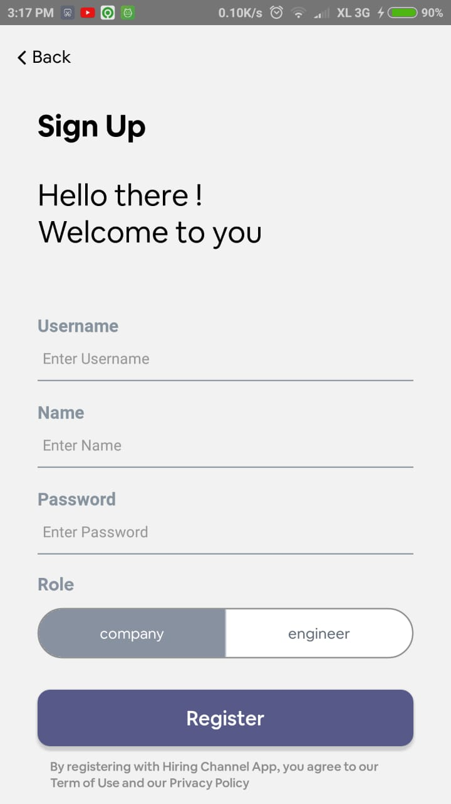
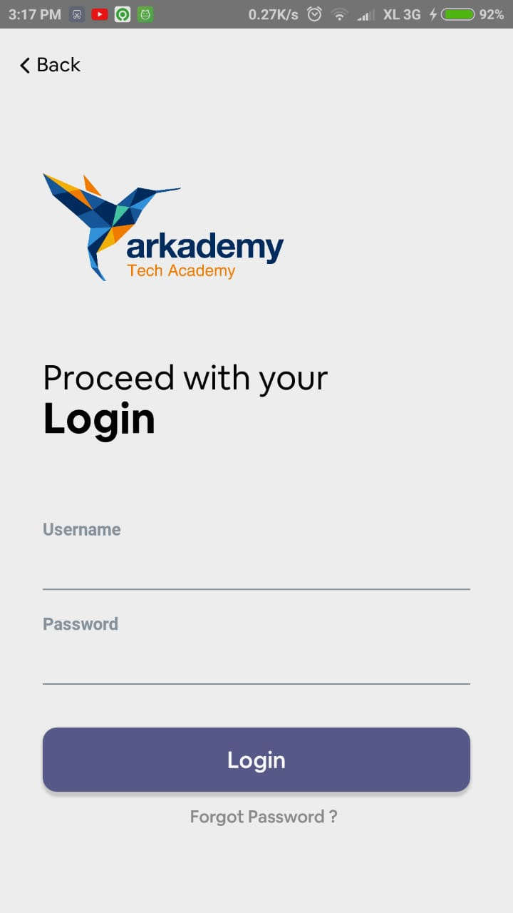
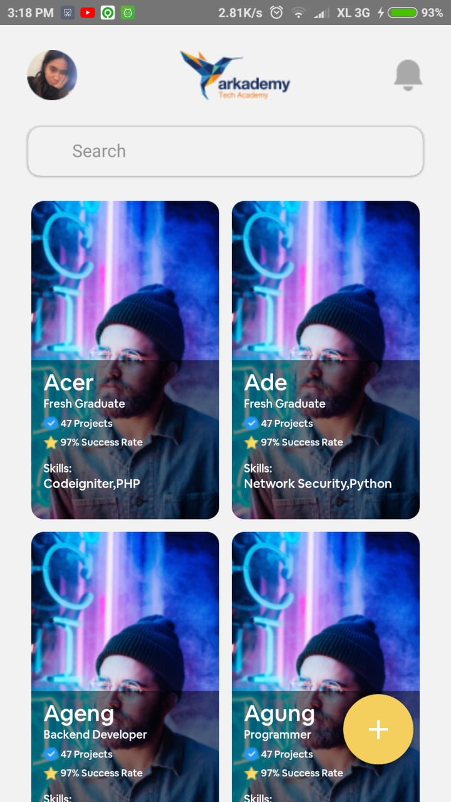
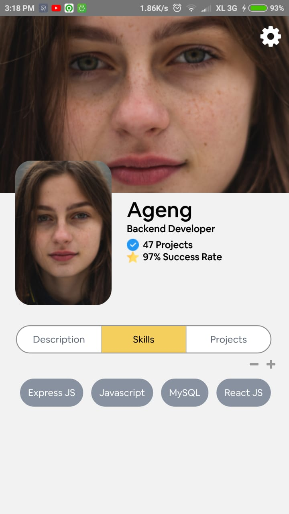
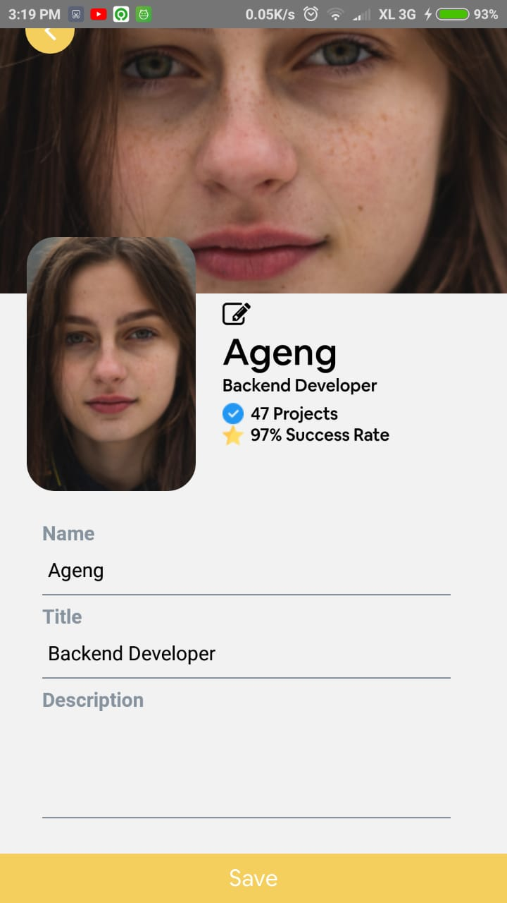

<h1 align="center">Hiring Channel</h1>
  

    <image align="center" width="200" src='./web_hi_res_512.png' />
  

  Built with <b>React Native</b>.

  <image width="100" src="https://upload.wikimedia.org/wikipedia/commons/a/a7/React-icon.svg" />
  

## Table of Contents

- [Introduction](#Introduction)
- [Features](#Features)
- [Requirements](#Requirements)
- [Screenshots](#Screenshots)
- [Release APK](#Release-APK)
- [Related Project](#Related-Project)
- [Contributors](#Contributors)

## Introduction
<b>Hiring Channel App</b> is a Android app that build for company to scouting and hiring available Engineer based on preference (skill, name, etc).
## Features
* Register User
* Sort and filter engineer with skill or name (Not Yet)
* Pagination (Not Yet)
* Company can hire engineer with project (Not Yet)
* Create Read Update Company
* Create Read Update Engineer

## Requirements
* [`nodejs`](https://nodejs.org/en/download/)
* [`react-native`](https://facebook.github.io/react-native/docs/getting-started)
* [`react-native-cli`](https://facebook.github.io/react-native/docs/getting-started)
* [`HiringChannelApp`](https://github.com/melankolia/HiringChannel-ReactNative/)

## Screenshots

    
    
    
    
    
    
    

## Release APK

## Related Project
* [`Frontend-HiringChannelApp-Front-Redux`](https://github.com/melankolia/HiringChannelApp-Front-Redux)
* [`Backend-HiringChannelApp`](https://github.com/melankolia/HiringChannelApp)

## Contributors

  <table>
    <tr>
      <td align="center">
        <a href="https://github.com/melankolia">
          <b>Ageng Setyo Nugroho</b>
        </a>
      </td>
    </tr>
  </table>

